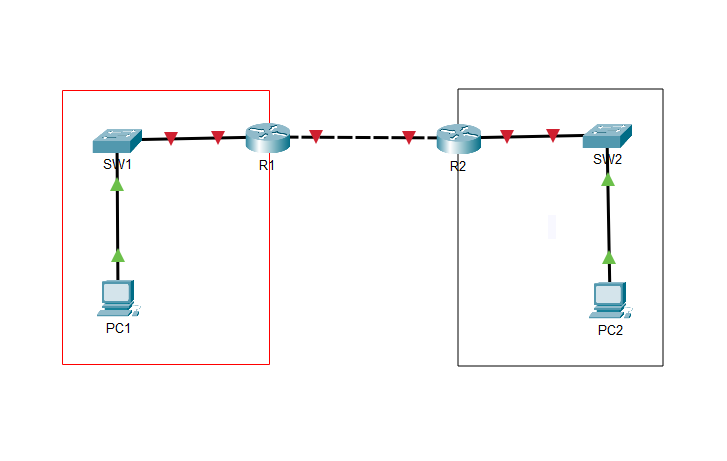
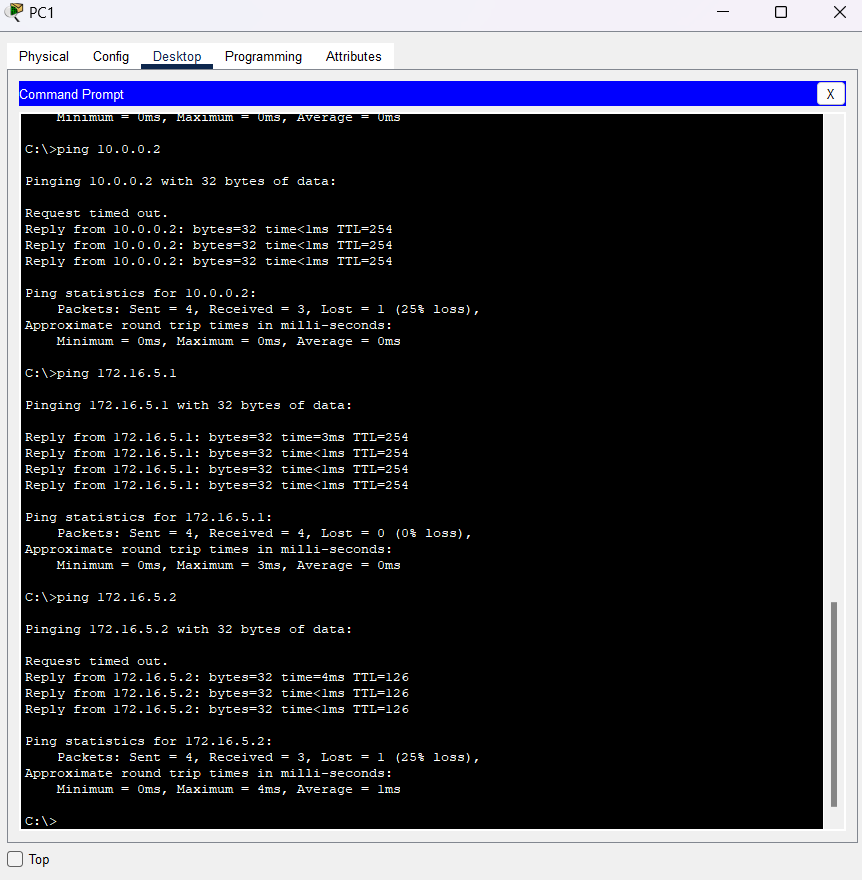

# Networking Projects

Explore the projects below:

## WAN Topology Configuration

Below is a detailed walkthrough of the WAN Topology Configuration project, including images and videos to guide you through each step.

### Step 1: Topology

This step involves understanding and setting up the topology of the network. The topology defines how different nodes and devices are arranged and interconnected in the network to support communication.

### Step 2: Configure Router 1

In this step, you will configure Router 1 to establish the initial settings and prepare it for connectivity.

### Step 3: Configure Router 2

Configure Router 2 to complete the initial setup and ensure it is ready for network operations.

### Step 4: Configure PC 1

Set up the network configuration for PC 1, ensuring it has the correct IP settings for communication.

### Step 5: Configure PC 2

Configure PC 2 to finalize its network setup with appropriate IP settings.

### Step 6: Attempt to ping PC 2 from PC 1

This step demonstrates an initial ping attempt from PC 1 to PC 2, which should show connectivity issues without proper routing.

### Step 7: Configure Static Route on Router 1

Set up a static route on Router 1 to enable communication between networks.

### Step 8: Configure Static Route on Router 2

Configure a static route on Router 2 to complete the routing setup and facilitate network connectivity.

### Step 9: Successful Ping

The final step shows a successful ping from PC 1 to PC 2, confirming that the static routes were configured correctly.

[Back to Home](index.html)
